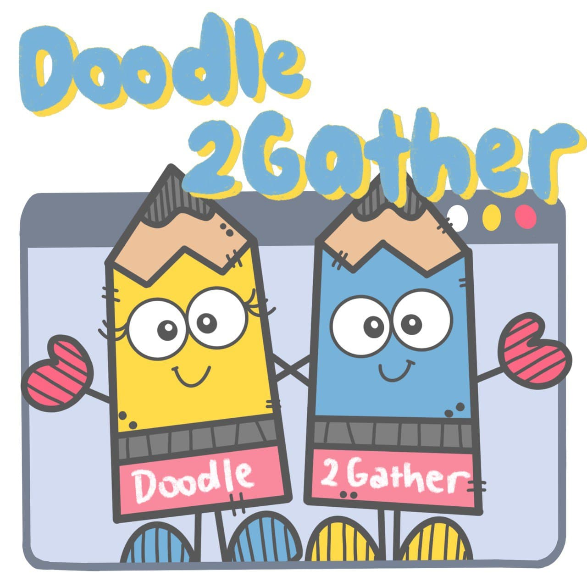
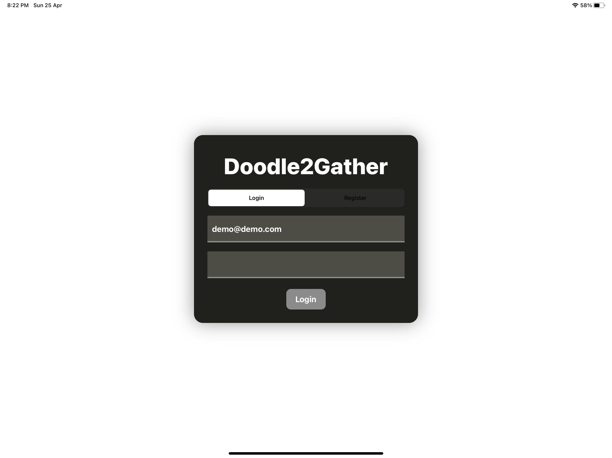
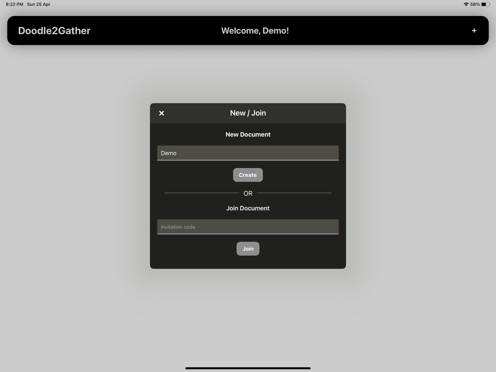
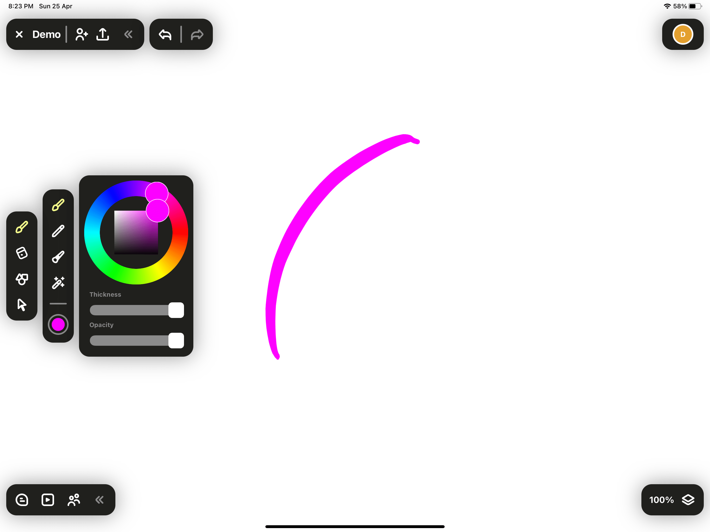
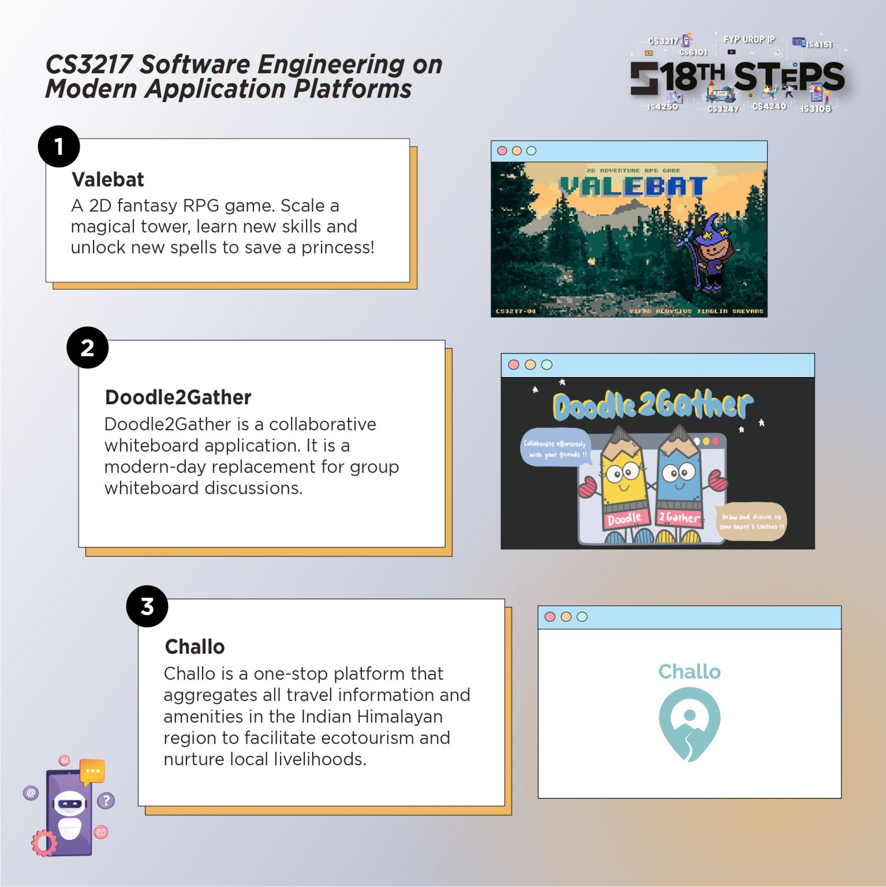

<!-- markdownlint-disable MD033 MD041 -->
<p align="center"></p>

<h1 align="center">Doodle2Gather</h1>

<p align="center">&nbsp;</p>

## Overview

Doodle2Gather is a collaborative whiteboarding application that aims to be a modern-day replacement for group whiteboard discussions, empowering users to better express themselves on a limitless online canvas.

This application is targeted towards teachers and students, designers, or just any team that requires some way to doodle and discuss online! With features such as video calling and powerful doodling tools, users are empowered in their idea generation and discussion online.

## Team Members

This iPadOS app is made as a final project in CS3217. Made with love by:

- [Christopher Goh Zhen Fung](https://github.com/chrisgzf)
- [He Xinyue](https://github.com/eksinyue)
- [Wang Luo](https://github.com/Asthenosphere)
- [Zhu Hanming](https://github.com/zhuhanming)

## Demo Video

<p align="center"><a href="https://youtu.be/5cVotr76mx4"></img></a></p>

## Getting Started

To run this application locally, first clone this repository.

```bash
git clone https://github.com/Doodle2Gather/Doodle2Gather.git
```

Then, run the following command in the root directory of the cloned repository:

```bash
pod install
```

Finally, open the `Doodle2Gather.xcworkspace` file to view the project. You will need to change the development team and bundle identifier accordingly to be able to build it locally.

> **Note:** If you're running on a Mac with Apple Silicon, you will be unable to build this project for simulator usage, due to some issues with the required binaries. However, you will still be able to build it for usage on an actual iPad.

## Documentation

Please refer to our documentation [here](https://docs.google.com/document/d/1YHIeYItLVKq1dylE3xsEbKLenVRUJUBSOCTZXZCkBd4/edit?usp=sharing).

## User Manual

Please refer to our user manual [here](https://docs.google.com/document/d/1__XYLX_i-vQkNeOcdnSmMe0-41bnLUMIobCyPf9YmiM/edit?usp=sharing). It contains detailed information about each of our features and how to use them.

We have also copied the Quick Start section of the user manual below.

### Launching the App

1. On the home screen of your iPad running on iOS 14.0 or later, tap the app icon.
1. You will be presented with the login screen of our app.

### User Login

1. Type in your email and password to log in to the app.
1. If you do not have an account, you can also register one easily.

<p align="center"></p>

### Document Gallery

1. Inside the document gallery, tap on a document to enter the shared document, if there is already one.
1. Otherwise, you can tap on the plus sign at the top right corner to create a new document.

<p align="center"></p>

### Inside a Meeting Room

1. On the document canvas, drag your finger or use the Apple Pencil to draw.
1. You can tap on the invite button in the top left panel to view the invite code. This invite code can be shared with other collaborators so that they can join the room.
1. You can tap the start button in the bottom left panel to start or join a video call.
1. You can also send text messages to fellow collaborators.

<p align="center"></p>

There are many other features for you to try! Do read the full [user manual](https://docs.google.com/document/d/1__XYLX_i-vQkNeOcdnSmMe0-41bnLUMIobCyPf9YmiM/edit?usp=sharing) if you are keen to find out more.

## Miscellaneous

Doodle2Gather was fortunate to have won the second place for the 18th SoC Term Project Showcase (STePS).

<p align="center"></p>
